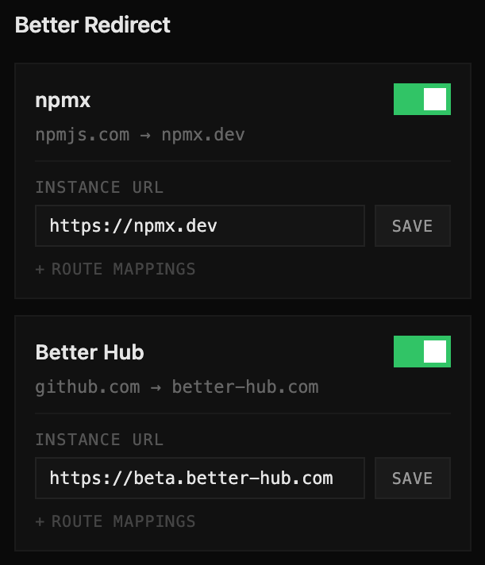

# Better Redirect

A Chrome extension that redirects web services to their alternative frontends.



## Supported Services

| Source     | Target         | Default                       |
| ---------- | -------------- | ----------------------------- |
| npmjs.com  | npmx.dev       | `https://npmx.dev`            |
| github.com | better-hub.com | `https://beta.better-hub.com` |

Each service can be toggled on/off independently, and the target host URL is customizable.

## Features

- **Per-service toggle** — enable or disable each redirect independently
- **Custom instance URL** — point to your own self-hosted instance
- **Allow list** — login, settings, and other non-redirectable pages are excluded automatically
- **Declarative Net Request** — uses Chrome's `declarativeNetRequest` API for fast, efficient redirects without intercepting network traffic

## Install

1. Clone this repo
2. Open `chrome://extensions/`
3. Enable **Developer mode**
4. Click **Load unpacked** and select this directory

## Project Structure

```
manifest.json    — Extension manifest (MV3)
background.js    — Service worker: builds DNR rules, handles messages
services.js      — Service configurations (redirect rules, allow lists)
popup.html       — Popup UI styles and layout
popup.js         — Popup logic: render services, bind toggle/save events
icons/           — Extension icons (active & disabled states)
```

## How It Works

The extension uses Chrome's [Declarative Net Request](https://developer.chrome.com/docs/extensions/reference/api/declarativeNetRequest) API. On install or browser startup, `background.js` reads the service configs from `services.js`, combines them with user settings from `chrome.storage.local`, and registers dynamic redirect rules. Each service has:

- **Allow rules** (priority 5) — prevent redirects on excluded pages (login, settings, etc.)
- **Redirect rules** (priority 1–4) — regex-based URL rewriting to the target host

## Adding a New Service

Add an entry to the `SERVICES` object in `services.js`:

```js
"my-service": {
  id: "my-service",
  name: "My Service",
  description: "example.com → my-alt.com",
  defaultHost: "https://my-alt.com",
  ruleIdBase: 3000,        // unique base, increments of 1000
  color: "#ff6600",
  sourceDomain: "example.com",
  allowList: ["login", "settings"],
  redirects: [
    {
      priority: 1,
      regexFilter: "^https://example\\.com/(.+)",
      substitution: "{host}/\\1",
    },
  ],
  routeMappings: [
    { from: "example.com/*", to: "my-alt.com/*" },
  ],
}
```

Then add the host permission in `manifest.json`:

```json
"host_permissions": ["*://example.com/*"]
```
